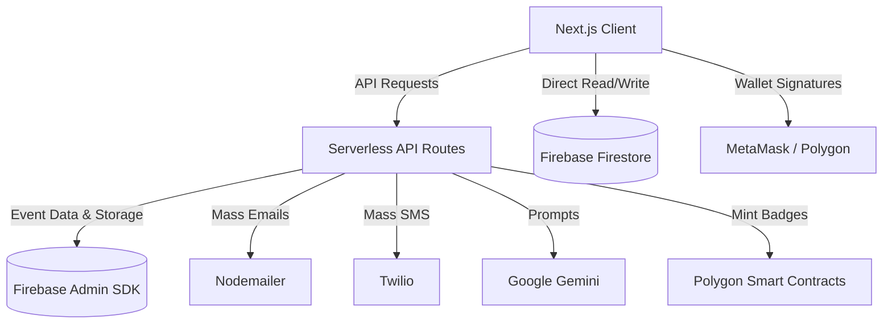
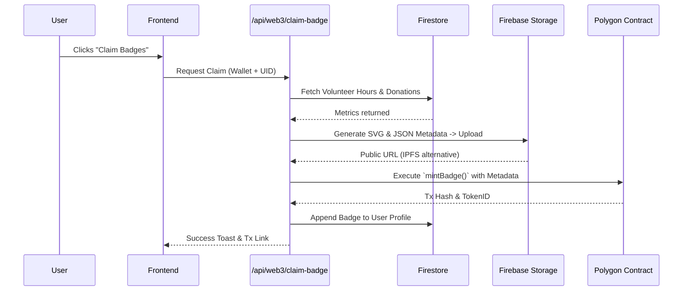

<div align="center">
  
# 🤝 NexusAid

**The AI-Powered, Web3-Verified Decentralized Relief Coordination Platform**

[](https://nextjs.org/)
[](https://tailwindcss.com/)
[](https://firebase.google.com/)
[](https://ai.google.dev/)
[](https://polygon.technology/)
[](https://docs.ethers.org/)

NexusAid is a cutting-edge platform designed to revolutionize disaster relief, volunteer coordination, and mutual aid. By combining the transparency of blockchain with the predictive power of Artificial Intelligence, NexusAid empowers local communities and NGOs to organize efficiently, build trust, and respond instantly during critical times.

[Report Bug](https://github.com/your-repo/issues) · [Request Feature](https://github.com/your-repo/issues)

</div>

---

## ✨ Revolutionary Pillars

### ⛓️ Web3 Trust & Transparent Escrow
* **Soulbound Tokens (SBTs):** Build immutable, on-chain reputation. Earn dynamic tiered badges (Bronze to Diamond) directly tied to your real-world volunteering hours and donations.
* **On-Chain Escrow:** Smart contract-based funding pools (NexusEscrow) ensure donations are securely locked and only released upon milestone completion.
* **Hybrid Storage:** Generated metadata and dynamic SVGs for user badges are uploaded securely to Firebase Storage, linked immutably on the Polygon network.

### 🛡️ Sentinel: Real-Time Environmental Hazard Monitoring
* **Live Telemetry:** Integrates directly with **USGS** and **NOAA** feeds to track environmental risks, including earthquakes, severe weather, and wildfires.
* **Geospatial Mapping:** Interactive map overlays via Leaflet to visually map out hazards and nearby relief events.
* **Automated Early Warnings:** Alerts organizers and volunteers of critical signals before they escalate, routing relief to where it's needed most.

### 🧠 Generative AI Operations
* **AI Matchmaking:** A proprietary scoring algorithm dynamically pairs volunteers to local needs based on unique skillsets, availability, and hardware resources.
* **Campaign Generators:** Effortlessly draft compelling campaign descriptions and needs-lists using Gemini 1.5.
* **Always-On Assistant:** Integrated 24/7 AI chatbot capable of answering community questions, guiding new volunteers, and breaking down complex tasks.

### ⚡ Mass Coordination & Communications
* **Omnichannel Broadcasts:** Native bulk parsing for `.csv`/`.xlsx` files, automatically mapping outreach strategies.
* **SMS & Email Automations:** Unified delivery of event invitations and updates via **Twilio** and **Nodemailer**.
* **Real-time Comms:** Dedicated Firebase-backed chat rooms for instantaneous team coordination on the ground.

---

## 🛠 Tech Stack Masterclass

| Domain | Technologies |
| :--- | :--- |
| **Frontend Architecture** | Next.js (App Router), React 19, TypeScript, Turbopack |
| **Styling & UI/UX** | Tailwind CSS 4, Framer Motion, Glassmorphism UI |
| **Web3 & Blockchain** | Solidity, Hardhat, Ethers.js v6, Polygon (Amoy Testnet) |
| **Database & Identity** | Firebase (Firestore, Auth, Admin SDK, Storage) |
| **Artificial Intelligence** | Google Generative AI (Gemini 1.5+), OpenAI API |
| **Mapping & Geospatial** | Leaflet.js, React-Leaflet, OpenStreetMap |
| **Communications** | Twilio, Nodemailer, Papaparse, XLSX |

---

## 🏗 System Architecture

### Macro Data Flow


### On-Chain Identity Generation Flow (SBTs)


---

## 🚀 Getting Started

### 1. Prerequisites
Ensure you have the following installed and configured:
- **Node.js 18+**
- **Firebase Project** (Firestore, Storage, Authentication)
- **Web3 Wallet** (MetaMask with Polygon Amoy network configured)
- API Keys for **Gemini** and (Optional) **Twilio/Razorpay**

### 2. Environment Configuration
Clone the repository and create a `.env.local` file in the root.

```env
# ==========================================
# FIREBASE CONFIGURATION
# ==========================================
NEXT_PUBLIC_FIREBASE_API_KEY="your_api_key"
NEXT_PUBLIC_FIREBASE_AUTH_DOMAIN="your_project.firebaseapp.com"
NEXT_PUBLIC_FIREBASE_PROJECT_ID="your_project_id"
NEXT_PUBLIC_FIREBASE_STORAGE_BUCKET="your_project.firebasestorage.app"
NEXT_PUBLIC_FIREBASE_MESSAGING_SENDER_ID="your_sender"
NEXT_PUBLIC_FIREBASE_APP_ID="your_app_id"
FIREBASE_PRIVATE_KEY="your_admin_private_key"
FIREBASE_CLIENT_EMAIL="your_admin_client_email"

# ==========================================
# WEB3 / POLYGON CONFIGURATION
# ==========================================
NEXT_PUBLIC_REPUTATION_CONTRACT="0xYourReputationContractAddress"
NEXT_PUBLIC_DONATE_CONTRACT="0xYourDonateContractAddress"
NEXT_PUBLIC_ESCROW_CONTRACT="0xYourEscrowContractAddress"
POLYGON_AMOY_RPC_URL="https://rpc-amoy.polygon.technology"
DEPLOYER_PRIVATE_KEY="your_wallet_private_key" # Required for server-side minting

# ==========================================
# ARTIFICIAL INTELLIGENCE
# ==========================================
GEMINI_API_KEY="your_gemini_key"
GEMINI_API_KEY_AI_CHAT_BOT="your_gemini_bot_key"

# ==========================================
# MASS COMMUNICATIONS (Optional)
# ==========================================
EMAIL="your_smtp_email@gmail.com"
EMAIL_PASS="your_smtp_password"
TWILIO_SID="your_twilio_sid"
TWILIO_AUTH="your_twilio_auth"
TWILIO_PHONE="your_twilio_phone"
```

### 3. Installation & Execution
```bash
# Install package dependencies
npm install

# Start the development server
npm run dev
```
Navigate to `http://localhost:3000` to access the platform.

---

## 🔐 Security & Operations
* **Strict Admin Validations:** The `claim-badge` and mass-communication endpoints use the Firebase Admin SDK to ensure no malicious client can manipulate their reputation or bypass access controls.
* **On-Chain Immutability:** Escrow ledgers and Badge mappings are permanently secured on the Polygon network.
* **Serverless Scale:** Powered by Vercel edge/serverless architecture, ensuring immediate global scaling during rapid emergency relief demands.

---

<div align="center">
  <i>Engineered with ❤️ for decentralized community resilience.</i>
</div>
