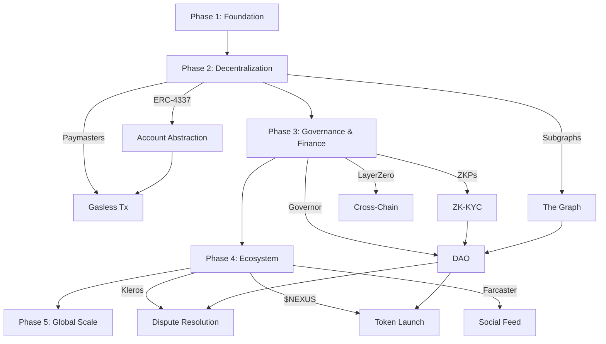

# 🗺️ NexusAid — Strategic Product Roadmap

> **Vision:** Build the world's most transparent, accountable, and technologically advanced decentralized disaster relief and crowdfunding platform — where every cent is traceable, every milestone is verifiable, and every contributor's impact is permanently recorded on-chain.

> **Last Updated:** May 13, 2026

---

## How to Read This Roadmap

Each feature is tagged with:
- **Priority:** 🔴 Critical | 🟠 High | 🟡 Medium | 🟢 Nice-to-Have
- **Complexity:** ⚡ Low | ⚡⚡ Medium | ⚡⚡⚡ High | ⚡⚡⚡⚡ Very High
- **Category:** 🔗 Blockchain | 🛡️ Security | 🏛️ Governance | 💰 Finance | 🧠 AI | 🌐 Infrastructure | 👥 Social

---

## Phase 1: Foundation & Stabilization ✅ *(Current — Completed)*

These features form the core platform and are already live on the local development environment.

| # | Feature | Status | Description |
|---|---|---|---|
| 1 | **Core Smart Contracts** | ✅ Done | `NexusDonate`, `NexusEscrow`, and `NexusReputation` deployed on local Hardhat node. Campaign creation, direct donations, milestone-gated escrow, and Soulbound Token (SBT) badge minting are all functional. |
| 1b | **Unified Donation Tracking** | ✅ Done | `donationService.ts` records Razorpay (fiat), crypto (ETH/MATIC), and cash donations into Firestore with dual-write to event and user subcollections, atomic fund counter updates, receipt ID generation, and offline donation verification via admin approval API. |
| 1c | **Backend Event Indexer** | ✅ Done | Express server with listeners for `DonationMade`, `CampaignCreated`, `FundsWithdrawn`, `BadgeMinted`, `MilestoneApproved`, and `RefundIssued` events — all synced to Firestore in real-time. |
| 1d | **IPFS Storage (Pinata)** | ✅ Done | Pinata upload helper, server-side API route (`/api/ipfs/upload`), and `useIPFSUpload` React hook for decentralized file storage. |
| 2 | **Monorepo Architecture** | ✅ Done | Codebase restructured into `frontend/`, `backend/`, `contracts/`, and `documentation/` workspaces with npm workspace management from the root `package.json`. |
| 3 | **MetaMask Wallet Integration** | ✅ Done | Full `useWallet` hook with auto-detection, connection, EIP-191 signature-based wallet linking, account change listeners, and automatic `chainChanged` page reload. |
| 4 | **Dynamic Network Switching** | ✅ Done | Frontend auto-detects `localhost` vs production and switches MetaMask to the correct network (Hardhat 31337 or Amoy 80002). `BrowserProvider` initialized with `'any'` to prevent Ethers.js v6 `NETWORK_ERROR`. |
| 5 | **Soulbound Token Badge System** | ✅ Done | Six-tier badge hierarchy (Bronze → Diamond). Badges are non-transferable ERC-721 tokens. Server-side minting via authenticated API route with Firebase `verifyIdToken`. |
| 6 | **Blockchain Hub Dashboard** | ✅ Done | Bento-grid dashboard showing wallet identity, ETH balance, badge count, global mints, network info, contract addresses, and badge tier guide. |
| 7 | **Fiat + Crypto Donation Duality** | ✅ Done | Users can donate via Razorpay (INR/fiat) or MetaMask (ETH/crypto) on the same event page. Crypto donations are recorded on-chain. |
| 8 | **AI-Powered Features** | ✅ Done | Gemini-powered event description generator, AI chatbot, AI Sentinel disaster monitoring, and smart event recommendations. |
| 9 | **Real-time Read-Only Resilience** | ✅ Done | Static `JsonRpcProvider` instances for read-only contract calls. Contract existence checked via `getCode()` before method invocations to prevent `BAD_DATA` crashes. |

---

## Phase 2: Advanced Decentralization & Usability 🔨 *(Q3 – Q4 2026)*

Focus: Remove Web3 friction, add permanent storage, enable gasless UX, and build robust on-chain data indexing.

| # | Feature | Priority | Complexity | Category | Description |
|---|---|---|---|---|---|
| 10 | **Account Abstraction (ERC-4337)** | 🔴 | ⚡⚡⚡ | 🔗 | Implement smart contract wallets so users can sign in with Google/Apple instead of managing seed phrases. Use bundlers and paymasters to abstract away gas. This is the single most impactful UX improvement for mainstream adoption. |
| 11 | **Gasless Transactions (Paymaster Integration)** | 🔴 | ⚡⚡⚡ | 🔗 | Integrate Biconomy or Gelato paymasters to sponsor gas fees for users. Donors should never need to hold native tokens just to make a donation. 100% of contributed value should reach the campaign. |
| 12 | **Decentralized Storage (IPFS/Arweave)** | 🟠 | ⚡⚡ | 🌐 | Migrate all campaign imagery, milestone evidence documents, and audit logs from Cloudinary/Firebase Storage to IPFS (via Pinata/Web3.Storage) or Arweave for permanent, censorship-resistant storage. Store CIDs on-chain as part of campaign metadata. |
| 13 | **The Graph Protocol Integration** | 🟠 | ⚡⚡⚡ | 🔗 | Deploy custom subgraphs to index `DonationMade`, `CampaignCreated`, `BadgeMinted`, `MilestoneApproved`, and `FundsWithdrawn` events. Replace direct RPC queries with GraphQL for 10x faster reads, pagination, filtering, and historical analytics. |
| 14 | **Fiat-to-Crypto Onramp** | 🟠 | ⚡⚡ | 💰 | Integrate MoonPay, Transak, or Wert directly into the donation flow. Users can donate with a credit card, and the onramp converts to MATIC/USDC and sends it to the smart contract — all in one step. |
| 15 | **Dynamic NFT Badges** | 🟡 | ⚡⚡ | 🔗 | Upgrade SBTs to dynamic NFTs where the visual metadata (image, description, tier) evolves automatically as a donor's cumulative contributions increase. Use on-chain SVG rendering or Chainlink Functions for metadata updates. |
| 16 | **Multi-Signature Escrow Approval (Gnosis Safe)** | 🟠 | ⚡⚡⚡ | 🛡️ | For high-value campaigns (>$10K equivalent), require milestone approvals from a multi-sig wallet (e.g., 3-of-5 council members) instead of a single admin. This decentralizes trust in the escrow process. |
| 17 | **Upgradeable Contract Architecture (UUPS Proxy)** | 🔴 | ⚡⚡⚡ | 🔗 | Implement OpenZeppelin UUPS (Universal Upgradeable Proxy Standard) for all three contracts. This allows bug fixes and feature additions without redeploying and losing on-chain state. Critical before any mainnet deployment. |

---

## Phase 3: Financial Primitives & Governance *(Q1 – Q2 2027)*

Focus: Introduce DeFi mechanics, community governance, and privacy-preserving identity.

| # | Feature | Priority | Complexity | Category | Description |
|---|---|---|---|---|---|
| 18 | **Yield Generation on Idle Escrow Funds** | 🟠 | ⚡⚡⚡ | 💰 | Idle funds locked in escrow (awaiting milestone approval) are automatically deposited into Aave or Compound lending pools to generate yield. The accrued interest is donated to the platform's general relief fund or distributed proportionally to the campaign. |
| 19 | **Quadratic Funding Matching Pools** | 🟠 | ⚡⚡⚡⚡ | 💰 | Implement Gitcoin-style quadratic funding where the *number* of unique donors matters more than the size of individual donations. Corporate sponsors fill a matching pool, and smart contracts distribute matching funds algorithmically to maximize democratic impact. |
| 20 | **NexusAid DAO Governance** | 🔴 | ⚡⚡⚡⚡ | 🏛️ | Transition platform governance to a Decentralized Autonomous Organization (DAO). Token holders (or SBT badge holders) vote on: which campaigns get featured, matching fund allocations, platform parameter changes, and dispute resolutions. Implement via OpenZeppelin Governor + Timelock. |
| 21 | **Decentralized Identity (DID) Integration** | 🟠 | ⚡⚡⚡ | 🛡️ | Integrate ENS (Ethereum Name Service), Lens Protocol handles, or Worldcoin World ID for verified human identity. This prevents Sybil attacks on quadratic funding, ensures one-person-one-vote in the DAO, and adds portable reputation. |
| 22 | **Zero-Knowledge KYC for Organizers (ZK-KYC)** | 🟠 | ⚡⚡⚡⚡ | 🛡️ | Use Zero-Knowledge Proofs (ZKPs) via Polygon ID or Semaphore to verify that a campaign organizer has passed KYC/AML checks without ever exposing their personal data on-chain. The smart contract only stores a proof hash — not the identity. |
| 23 | **Anonymous Donations via ZKPs** | 🟡 | ⚡⚡⚡⚡ | 🛡️ | Allow donors to mask their wallet address and donation amount on the public ledger while still cryptographically proving they made a valid contribution. Uses ZK-SNARKs (e.g., via Noir or Circom) to generate donation proofs that the contract verifies without revealing the donor. |
| 24 | **Cross-Chain Donations (LayerZero / Chainlink CCIP)** | 🟠 | ⚡⚡⚡⚡ | 🔗 | Enable users to donate using native assets on Ethereum, Arbitrum, Optimism, Base, or BNB Chain without manual bridging. The cross-chain messaging protocol routes the assets to the NexusDonate contract on Polygon. Vastly expands the donor pool. |
| 25 | **Chainlink Oracle-Triggered Relief** | 🟡 | ⚡⚡⚡ | 🔗 | Connect Chainlink oracles to real-world disaster data feeds (NOAA, USGS, WHO). Smart contracts can automatically trigger pre-funded escrow releases when a verified natural disaster event is detected — zero human delay in crisis response. |

---

## Phase 4: Ecosystem Expansion & Social Web3 *(Q3 2027+)*

Focus: Build community coordination tools, launch the token economy, and scale to a global NGO network.

| # | Feature | Priority | Complexity | Category | Description |
|---|---|---|---|---|---|
| 26 | **Token-Gated Community Channels** | 🟡 | ⚡⚡ | 👥 | Integrate Guild.xyz to grant access to specialized Discord/Telegram coordination channels based on held SBTs. Diamond badge holders get access to the Strategic Council channel; Bronze holders get the General Community channel. |
| 27 | **Decentralized Dispute Resolution (Kleros)** | 🟠 | ⚡⚡⚡ | 🏛️ | Integrate Kleros decentralized court for milestone disputes. If a donor believes a milestone was not genuinely completed, they can initiate a dispute. Randomly selected jurors review the evidence and vote. The losing party pays the arbitration fee. |
| 28 | **$NEXUS Utility & Governance Token** | 🟡 | ⚡⚡⚡⚡ | 💰 | Launch a platform-native ERC-20 token used for: DAO voting weight, staking for platform benefits, boosting campaign visibility, and rewarding volunteers. Tokenomics designed to be non-speculative with vesting, emission caps, and utility sinks. |
| 29 | **On-Chain Reputation Slashing** | 🟠 | ⚡⚡⚡ | 🛡️ | Mechanism to reduce reputation scores or burn SBTs of verified bad actors. Triggered by successful Kleros disputes or DAO votes. Ensures the reputation system has teeth — fraud has permanent, visible consequences. |
| 30 | **Decentralized Social Feed (Farcaster/Lens)** | 🟡 | ⚡⚡⚡ | 👥 | Replace the centralized Firebase-backed feed with a fully decentralized social layer using Farcaster Frames or Lens Protocol. Campaign updates, donation shoutouts, and milestone completions are posted as on-chain social content — verifiable and composable. |
| 31 | **Automated Emergency Liquidity Pools** | 🟡 | ⚡⚡⚡ | 💰 | Maintain on-chain reserve pools that automatically route funds to pre-approved disaster response organizations the moment a Chainlink oracle confirms a qualifying event. Zero bureaucratic delay — funds flow within minutes. |
| 32 | **Retroactive Public Goods Funding (RPGF)** | 🟡 | ⚡⚡⚡ | 💰 | Implement Optimism-style retroactive funding rounds. Early contributors, volunteers, and developers who built NexusAid's public goods infrastructure receive retroactive token airdrops based on their verified impact history (stored in SBTs). |
| 33 | **NFT Charity Art Marketplace** | 🟡 | ⚡⚡⚡ | 💰 | A decentralized marketplace where digital artists mint and auction NFTs. Smart contracts automatically route 100% of proceeds to specified NexusAid campaigns. Artists get permanent, verifiable credit via on-chain provenance. |
| 34 | **Volunteer Skill Micro-Endorsements** | 🟡 | ⚡⚡ | 👥 | Allow verified NGOs and relief organizations to issue micro-SBTs endorsing a volunteer's specific on-the-ground skills: "Certified First Aid," "Water Purification Specialist," "Logistics Coordinator." These compose into a portable, on-chain professional credential. |
| 35 | **AI-Powered On-Chain Fraud Detection** | 🟠 | ⚡⚡⚡⚡ | 🧠 | Deploy ML models that analyze on-chain transaction graphs, wallet histories, and behavioral patterns to flag potentially fraudulent campaigns before they gain traction. Integrates with the AI Sentinel system for real-time alerts. Suspicious campaigns are auto-flagged for DAO review. |
| 36 | **Regulatory-Compliant Smart Contract Pools** | 🟡 | ⚡⚡⚡ | 🛡️ | Specific campaign pools that enforce regulatory compliance (tax receipts, donor caps, geographic restrictions) entirely via smart contract logic. Enables NexusAid to operate legally in regulated jurisdictions without centralized compliance teams. |
| 37 | **Smart Contract Security Bounty Program** | 🟠 | ⚡ | 🛡️ | Establish a permanent, high-reward bug bounty program on Immunefi. Invite white-hat hackers to audit NexusDonate, NexusEscrow, and NexusReputation for vulnerabilities. Bounties scale with severity: up to $50K for critical findings. |
| 38 | **Flash Loan Attack Protection** | 🟠 | ⚡⚡⚡ | 🛡️ | Implement robust defense mechanisms against flash-loan governance attacks when the DAO goes live. Includes snapshot-based voting (vote weight locked at proposal creation), time-weighted average balances, and minimum holding period requirements. |
| 39 | **Mobile-First PWA with Embedded Wallets** | 🟠 | ⚡⚡⚡ | 🌐 | Deep optimization of the Next.js frontend into a Progressive Web App (PWA) that feels completely native on mobile. Integrate embedded wallets (Privy, Dynamic, or Web3Auth) that use device secure enclaves for key management — no MetaMask extension needed on mobile. |

---

## Phase 5: Global Scale & Institutional Adoption *(2028+)*

| # | Feature | Priority | Complexity | Category | Description |
|---|---|---|---|---|---|
| 40 | **Global NGO Consortium Node Network** | 🟢 | ⚡⚡⚡⚡ | 🌐 | Partner with UNICEF, Red Cross, Médecins Sans Frontières, and other major NGOs to run dedicated validator/infrastructure nodes. This creates a semi-permissioned, purpose-built relief network with institutional credibility and true decentralization. |
| 41 | **Layer 2 Rollup or Appchain** | 🟢 | ⚡⚡⚡⚡ | 🔗 | Evaluate deploying a NexusAid-specific L2 rollup (via OP Stack, Arbitrum Orbit, or Polygon CDK) or an appchain to achieve: near-zero gas costs, custom precompiles for donation-specific opcodes, and sovereign data availability. |
| 42 | **Real-Time Impact Dashboard with Data Provenance** | 🟢 | ⚡⚡⚡ | 🌐 | A public-facing, read-only dashboard (no wallet required) showing global NexusAid impact: total funds raised, campaigns completed, badges minted, funds in escrow, and per-region breakdowns. All data pulled from subgraphs with cryptographic provenance proofs. |

---

## Dependency Graph

---

## Release Timeline (Projected)

| Quarter | Milestone | Key Deliverables |
|---|---|---|
| **Q2 2026** | v0.2.0 — Foundation ✅ | Monorepo, 3 contracts, wallet integration, SBTs, Blockchain Hub |
| **Q2 2026** | v0.2.1 — Donations ✅ | Unified donation tracking, payment verification, backend indexer, IPFS uploads, offline donation approval, Firestore security rules |
| **Q3 2026** | v0.3.0 — Hardening | Contract tests, Amoy deployment, escrow UI end-to-end, email receipts |
| **Q4 2026** | v0.4.0 — UX Leap | Account Abstraction, gasless tx, IPFS storage, The Graph |
| **Q1 2027** | v0.5.0 — Governance | DAO launch, quadratic funding, DID integration, ZK-KYC |
| **Q2 2027** | v0.6.0 — Finance | Yield on escrow, cross-chain, oracle-triggered relief |
| **Q3 2027** | v0.7.0 — Ecosystem | Token launch, Kleros, NFT marketplace, social feed |
| **Q4 2027** | v0.8.0 — Security | Bug bounties, flash loan protection, fraud detection |
| **2028** | v1.0.0 — Mainnet | Polygon PoS deployment, NGO consortium, public dashboard |

---

> *"The best time to build transparent infrastructure was yesterday. The second best time is now."*  
> — The NexusAid Team
