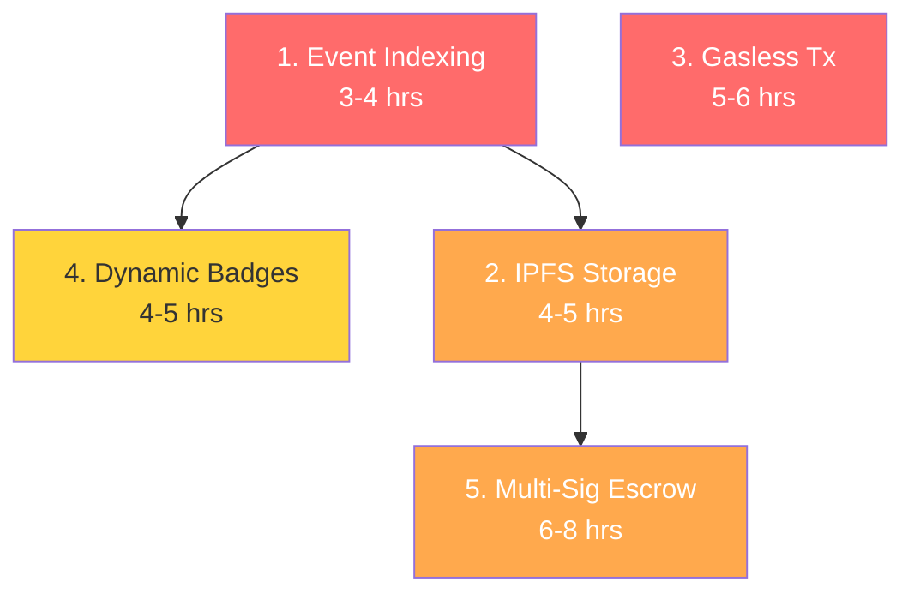

# 🔧 NexusAid — Web3 Implementation Plan

> **5 features. Detailed specs. Ready to build.**  
> **Last Updated:** May 13, 2026

---

## Feature 1: Blockchain Event Indexing ✅ COMPLETED

### Problem
When a donation happens on-chain, Firestore has no idea. The dashboard stats are disconnected from blockchain reality.

### Solution
Build an Express service in `/backend` that listens to smart contract events and writes structured records to Firestore in real-time.

### Architecture
```
Hardhat Node ──(events)──► Backend Listener ──(writes)──► Firestore
                              │
                              ├─ DonationMade → donations/{id}
                              ├─ CampaignCreated → events/{id}/blockchain
                              ├─ BadgeMinted → users/{uid}/badges/{id}
                              └─ MilestoneApproved → escrows/{id}/milestones/{idx}
```

### Dependencies
```json
// Add to backend/package.json
{
  "ethers": "^6.16.0"
}
```

### Files to Create/Modify

| File | Action | Purpose |
|---|---|---|
| `backend/src/listeners/donateListener.js` | Create | Subscribe to `DonationMade`, `CampaignCreated`, `FundsWithdrawn` |
| `backend/src/listeners/escrowListener.js` | Create | Subscribe to `DonationReceived`, `MilestoneApproved`, `RefundIssued` |
| `backend/src/listeners/reputationListener.js` | Create | Subscribe to `BadgeMinted` |
| `backend/src/config/contracts.js` | Create | Shared ABI + address config |
| `backend/src/config/firebase.js` | Create | Firebase Admin init |
| `backend/src/index.js` | Create | Express server + listener bootstrap |
| `backend/.env` | Create | RPC_URL, contract addresses, Firebase service account |
| `root package.json` | Modify | Add `"dev:backend"` script |

### Implementation Steps

**Step 1: Contract Config (`backend/src/config/contracts.js`)**
- Export ABIs (copy from frontend `lib/web3/*.ts` — only the event signatures)
- Export contract addresses from env vars
- Export a `JsonRpcProvider` pointed at `process.env.RPC_URL`

**Step 2: Firebase Config (`backend/src/config/firebase.js`)**
- Initialize `firebase-admin` with service account credentials
- Export `db` (Firestore instance)

**Step 3: Donate Listener (`backend/src/listeners/donateListener.js`)**
```javascript
// Pseudocode
const contract = new Contract(DONATE_ADDRESS, DONATE_ABI, provider);

contract.on("DonationMade", async (campaignId, donor, amount, event) => {
  await db.collection("donations").add({
    campaignId: campaignId.toString(),
    donor: donor,
    amount: formatEther(amount),
    amountWei: amount.toString(),
    txHash: event.log.transactionHash,
    blockNumber: event.log.blockNumber,
    timestamp: admin.firestore.FieldValue.serverTimestamp(),
    source: "blockchain",
  });
  
  // Also update the event's totalRaised in Firestore
  // Look up firebaseEventId from contract, then update
});

contract.on("CampaignCreated", async (id, firebaseEventId, organizer) => {
  await db.collection("events").doc(firebaseEventId).set({
    blockchainCampaignId: id.toString(),
    organizerWallet: organizer,
    onChain: true,
  }, { merge: true });
});
```

**Step 4: Escrow + Reputation Listeners** — Same pattern, different events.

**Step 5: Index Server (`backend/src/index.js`)**
```javascript
const express = require('express');
const app = express();

// Health check endpoint
app.get('/health', (req, res) => res.json({ status: 'ok' }));

// Start all listeners
require('./listeners/donateListener');
require('./listeners/escrowListener');
require('./listeners/reputationListener');

app.listen(4000, () => console.log('Indexer running on :4000'));
```

**Step 6: Root package.json** — Add `"dev:backend": "npm run start --workspace=backend"`

### Firestore Schema Additions

```
donations/{auto-id}
  ├── campaignId: string
  ├── donor: string (wallet address)
  ├── amount: string (formatted ETH)
  ├── amountWei: string
  ├── txHash: string
  ├── blockNumber: number
  ├── timestamp: Timestamp
  └── source: "blockchain"

events/{eventId}
  ├── blockchainCampaignId: string
  ├── organizerWallet: string
  └── onChain: boolean
```

### Testing Checklist
- [ ] Start Hardhat node → Deploy contracts → Start backend
- [ ] Make a donation via frontend → Verify Firestore document created
- [ ] Create a campaign → Verify event doc updated with `blockchainCampaignId`
- [ ] Mint a badge → Verify user badge doc created
- [ ] Kill backend → Restart → Verify it reconnects and catches up

### Estimated Effort: **3-4 hours** ✅ *Completed — All listeners implemented and operational.*

---

## Feature 2: IPFS Metadata Storage ✅ PARTIALLY COMPLETED

> **Note:** Basic IPFS upload functionality is complete (`pinata.ts`, `/api/ipfs/upload`, `useIPFSUpload` hook). Contract-level CID storage and milestone evidence CIDs are still pending.

### Problem
Campaign images and milestone evidence are stored on Cloudinary/Firebase — centralized, deletable, censorable.

### Solution
Upload campaign metadata to IPFS via **Pinata**, store the CID on-chain, and use IPFS gateways for retrieval.

### Architecture
```
Event Creation Flow:
  User uploads image ──► Frontend ──► Pinata API ──► IPFS (returns CID)
                                          │
                                          └──► CID stored on-chain in createCampaign()
                                          └──► CID stored in Firestore for fast reads
```

### Dependencies
```json
// Add to frontend/package.json
{
  "@pinata/sdk": "^2.1.0"
}
```

### Contract Changes

**Modify `NexusDonate.sol`:**
```solidity
struct Campaign {
    string firebaseEventId;
    string metadataCID;      // ← NEW: IPFS CID
    address organizer;
    uint256 totalRaised;
    bool active;
}

function createCampaign(
    string calldata _firebaseEventId,
    string calldata _metadataCID    // ← NEW parameter
) external returns (uint256) { ... }
```

**Modify `NexusEscrow.sol`:** Add `string evidenceCID` to `proposeMilestoneComplete()` so organizers attach IPFS-hosted proof.

### Files to Create/Modify

| File | Action | Purpose |
|---|---|---|
| `frontend/src/lib/ipfs/pinata.ts` | Create | Pinata upload helper (pinFileToIPFS, pinJSONToIPFS) |
| `frontend/src/app/api/ipfs/upload/route.ts` | Create | Server-side Pinata upload API route |
| `contracts/contracts/core/NexusDonate.sol` | Modify | Add `metadataCID` field |
| `contracts/contracts/web3/NexusEscrow.sol` | Modify | Add `evidenceCID` to milestone proposal |
| `frontend/src/app/(app)/create/page.tsx` | Modify | Upload to IPFS before creating campaign |
| `frontend/.env.local` | Modify | Add `PINATA_API_KEY`, `PINATA_SECRET_KEY` |

### Implementation Steps

**Step 1: Pinata Helper (`frontend/src/lib/ipfs/pinata.ts`)**
```typescript
export async function uploadToIPFS(file: File): Promise<string> {
  const formData = new FormData();
  formData.append('file', file);
  const res = await fetch('/api/ipfs/upload', { method: 'POST', body: formData });
  const { cid } = await res.json();
  return cid; // e.g., "QmXoypiz..."
}

export function ipfsToHTTP(cid: string): string {
  return `https://gateway.pinata.cloud/ipfs/${cid}`;
}
```

**Step 2: API Route (`frontend/src/app/api/ipfs/upload/route.ts`)**
- Accepts multipart form data
- Uploads to Pinata using server-side API keys
- Returns the CID

**Step 3: Contract Update** — Add `metadataCID` to Campaign struct, redeploy.

**Step 4: Frontend Integration** — In the Create Event flow, upload image to IPFS first, then pass the CID to `createCampaign()`.

**Step 5: Milestone Evidence** — When an organizer proposes a milestone, they upload evidence (photos/docs) to IPFS and the CID is stored on-chain.

### Environment Variables
```env
PINATA_API_KEY=your_pinata_key
PINATA_SECRET_KEY=your_pinata_secret
PINATA_GATEWAY_URL=https://gateway.pinata.cloud
```

### Testing Checklist
- [ ] Upload an image via the Create Event page → Verify CID returned
- [ ] CID stored on-chain in campaign struct
- [ ] Image loadable via `https://gateway.pinata.cloud/ipfs/{CID}`
- [ ] Milestone evidence uploaded and CID stored on-chain

### Estimated Effort: **4-5 hours**

---

## Feature 3: Gasless Transactions (Meta-Transactions) 🔴 Critical

### Problem
Users need ETH/MATIC to pay gas fees, which is a massive barrier for non-crypto-native users making their first donation.

### Solution
Integrate **Biconomy** (or OpenGSN) to relay transactions. The platform pays gas fees on behalf of users via a Paymaster contract.

### Architecture
```
User signs message ──► Frontend ──► Biconomy Bundler ──► On-chain execution
     (no gas)                           │                    (platform pays gas)
                                        └── Paymaster contract sponsors the tx
```

### Dependencies
```json
// Add to frontend/package.json
{
  "@biconomy/account": "^4.0.0",
  "@biconomy/bundler": "^4.0.0",
  "@biconomy/paymaster": "^4.0.0"
}
```

### Files to Create/Modify

| File | Action | Purpose |
|---|---|---|
| `frontend/src/lib/web3/biconomy.ts` | Create | Smart account + paymaster setup |
| `frontend/src/hooks/useSmartAccount.ts` | Create | React hook for gasless transactions |
| `frontend/src/components/web3/DonateWithCrypto.tsx` | Modify | Add "Gasless" toggle |
| `frontend/.env.local` | Modify | Add Biconomy API keys |

### Implementation Steps

**Step 1: Biconomy Config (`frontend/src/lib/web3/biconomy.ts`)**
```typescript
import { createSmartAccountClient } from "@biconomy/account";

export async function createGaslessClient(signer: JsonRpcSigner) {
  const smartAccount = await createSmartAccountClient({
    signer,
    bundlerUrl: process.env.NEXT_PUBLIC_BICONOMY_BUNDLER_URL!,
    paymasterUrl: process.env.NEXT_PUBLIC_BICONOMY_PAYMASTER_URL!,
  });
  return smartAccount;
}
```

**Step 2: Smart Account Hook (`frontend/src/hooks/useSmartAccount.ts`)**
- Wraps `useWallet` hook
- Creates a Biconomy Smart Account from the user's EOA signer
- Exposes `sendGaslessTransaction(to, data, value)` method

**Step 3: Modify DonateWithCrypto**
- Add a toggle: "⛽ Pay gas yourself" vs "🆓 Gasless (sponsored)"
- When gasless is selected, route the `donate()` call through the Biconomy smart account
- The user still signs with MetaMask, but the gas fee is paid by the platform's paymaster

**Step 4: Paymaster Funding**
- Create a Biconomy dashboard account
- Fund the paymaster with MATIC on Amoy testnet
- Set spending policies (max gas per tx, daily limits)

### Environment Variables
```env
NEXT_PUBLIC_BICONOMY_BUNDLER_URL=https://bundler.biconomy.io/api/v2/80002/xxx
NEXT_PUBLIC_BICONOMY_PAYMASTER_URL=https://paymaster.biconomy.io/api/v1/80002/xxx
```

### Important Notes
- Gasless tx only works on **Polygon Amoy/Mainnet**, not on local Hardhat node
- For local dev, the gasless toggle should be disabled with a tooltip: "Available on testnet/mainnet only"
- Smart accounts have different addresses than EOA wallets — the contract must accept calls from smart accounts

### Testing Checklist
- [ ] Create smart account from MetaMask signer
- [ ] Send gasless donation on Amoy testnet
- [ ] Verify gas was paid by paymaster (not user)
- [ ] Verify donation recorded on-chain correctly
- [ ] Gasless toggle disabled on localhost

### Estimated Effort: **5-6 hours**

---

## Feature 4: Dynamic NFT Badges 🟡 Medium

### Problem
Badges are minted once as static tokens. A user who earns Bronze gets a separate Silver later — no visual evolution.

### Solution
Upgrade `NexusReputation.sol` to support **dynamic metadata** that evolves based on cumulative on-chain activity.

### Architecture
```
User donates 3 times ──► API evaluates tier ──► Updates tokenURI on-chain
                                                    │
                                                    └── NFT image/metadata auto-updates
                                                        on OpenSea / any viewer
```

### Contract Changes

**Add to `NexusReputation.sol`:**
```solidity
// Allow owner to upgrade a badge's tier and metadata
function upgradeBadge(
    uint256 _tokenId,
    string calldata _newBadgeType,
    string calldata _newMetadataURI
) external onlyOwner {
    require(_exists(_tokenId), "Token does not exist");
    badges[_tokenId].badgeType = _newBadgeType;
    _setTokenURI(_tokenId, _newMetadataURI);
    emit BadgeUpgraded(_tokenId, _newBadgeType, block.timestamp);
}

// New event
event BadgeUpgraded(uint256 indexed tokenId, string newBadgeType, uint256 timestamp);
```

### Files to Create/Modify

| File | Action | Purpose |
|---|---|---|
| `contracts/contracts/web3/NexusReputation.sol` | Modify | Add `upgradeBadge()` function |
| `frontend/src/app/api/web3/upgrade-badge/route.ts` | Create | Server-side badge upgrade evaluation |
| `frontend/src/lib/web3/reputationContract.ts` | Modify | Add `upgradeBadge` to ABI |
| `frontend/src/lib/web3/badgeMetadata.ts` | Create | Generate on-chain SVG or JSON metadata per tier |

### Implementation Steps

**Step 1: On-Chain SVG Metadata (`frontend/src/lib/web3/badgeMetadata.ts`)**
```typescript
export function generateBadgeMetadata(tier: string, stats: UserStats): string {
  const svg = `<svg>... dynamic badge art based on tier ...</svg>`;
  const json = {
    name: `NexusAid ${tier} Badge`,
    description: `Awarded for ${stats.totalDonations} donations`,
    image: `data:image/svg+xml;base64,${btoa(svg)}`,
    attributes: [
      { trait_type: "Tier", value: tier },
      { trait_type: "Total Donated", value: stats.totalDonated },
      { trait_type: "Campaigns", value: stats.campaignCount },
    ],
  };
  return `data:application/json;base64,${btoa(JSON.stringify(json))}`;
}
```

**Step 2: Upgrade API Route (`/api/web3/upgrade-badge`)**
- Accepts `{ userId, tokenId }`
- Queries Firestore for user's cumulative stats
- Determines if they qualify for a tier upgrade
- Calls `upgradeBadge()` on-chain with new metadata URI
- Returns the new tier

**Step 3: Auto-Trigger** — After every successful donation (in the event indexer from Feature 1), check if the donor qualifies for an upgrade.

### Tier Upgrade Thresholds
| Current | Upgrade To | Criteria |
|---|---|---|
| Bronze | Silver | 3 total donations OR 0.5 ETH cumulative |
| Silver | Gold | 7 donations OR 2 ETH cumulative |
| Gold | Platinum | 15 donations OR 5 ETH cumulative |
| Platinum | Master | 30 donations OR 10 ETH cumulative |
| Master | Diamond | Admin-only (exceptional contribution) |

### Testing Checklist
- [ ] Mint a Bronze badge → Make 3 donations → Badge auto-upgrades to Silver
- [ ] Verify `tokenURI` on-chain returns updated metadata
- [ ] Badge display component shows new tier visual

### Estimated Effort: **4-5 hours**

---

## Feature 5: Multi-Sig Escrow Approval (Gnosis Safe) 🟠 High

### Problem
Currently, a single `owner` address approves milestones. For campaigns handling large sums, this is a centralized single point of failure.

### Solution
Replace the `onlyOwner` modifier on `approveMilestone()` with a **Gnosis Safe multi-sig** requirement for high-value campaigns.

### Architecture
```
Organizer proposes milestone ──► Safe UI shows pending approval
                                    │
                                    ├── Council Member 1 signs ✅
                                    ├── Council Member 2 signs ✅
                                    ├── Council Member 3 signs ✅ (3/5 threshold met)
                                    │
                                    └── Safe executes approveMilestone() on-chain
                                         └── Funds released to organizer
```

### Contract Changes

**Modify `NexusEscrow.sol`:**
```solidity
// Add a mapping for multi-sig approvers per campaign
mapping(uint256 => address) public campaignApprover; // campaignId => Safe address

function createCampaign(
    string calldata _firebaseEventId,
    string[] calldata _milestoneDescs,
    address _approver              // ← NEW: Safe address (or owner for small campaigns)
) external returns (uint256) {
    // ... existing logic ...
    campaignApprover[id] = _approver;
}

// Replace onlyOwner with dynamic approver check
function approveMilestone(uint256 _campaignId, uint8 _milestoneIndex) external {
    require(
        msg.sender == campaignApprover[_campaignId] || msg.sender == owner,
        "Not authorized approver"
    );
    // ... existing approval logic ...
}
```

### Files to Create/Modify

| File | Action | Purpose |
|---|---|---|
| `contracts/contracts/web3/NexusEscrow.sol` | Modify | Add `campaignApprover` mapping |
| `frontend/src/lib/web3/safe.ts` | Create | Gnosis Safe SDK integration |
| `frontend/src/components/web3/MultiSigPanel.tsx` | Create | UI for viewing/signing pending approvals |
| `frontend/src/app/api/web3/safe/route.ts` | Create | API for Safe transaction proposals |

### Implementation Steps

**Step 1: Deploy a Gnosis Safe on Polygon Amoy**
- Use https://app.safe.global to create a 3-of-5 multi-sig
- Add 5 council member wallet addresses
- Record the Safe contract address

**Step 2: Contract Update** — Add `campaignApprover` mapping. For campaigns with `totalRaised > threshold`, the approver is set to the Safe address.

**Step 3: Safe SDK Integration (`frontend/src/lib/web3/safe.ts`)**
```typescript
import Safe from "@safe-global/protocol-kit";
import SafeApiKit from "@safe-global/api-kit";

export async function proposeMilestoneApproval(
  safeAddress: string,
  escrowAddress: string,
  campaignId: number,
  milestoneIndex: number,
  signer: JsonRpcSigner
) {
  // Encode the approveMilestone call
  const iface = new Interface(ESCROW_ABI);
  const data = iface.encodeFunctionData("approveMilestone", [campaignId, milestoneIndex]);
  
  // Create Safe transaction
  const safeSdk = await Safe.init({ provider, signer, safeAddress });
  const tx = await safeSdk.createTransaction({
    transactions: [{ to: escrowAddress, value: "0", data }],
  });
  
  // Propose to Safe API (other signers can see & co-sign)
  const apiKit = new SafeApiKit({ chainId: 80002n });
  await apiKit.proposeTransaction({ ... });
}
```

**Step 4: Multi-Sig Panel Component** — Shows pending approvals, who has signed, and remaining signatures needed.

**Step 5: Threshold Logic** — In the Create Event flow, if the fundraising goal exceeds a threshold (e.g., 10 ETH), automatically assign the Safe as the approver.

### Dependencies
```json
{
  "@safe-global/protocol-kit": "^4.0.0",
  "@safe-global/api-kit": "^2.0.0"
}
```

### Testing Checklist
- [ ] Create campaign with Safe as approver
- [ ] Organizer proposes milestone completion
- [ ] 3 of 5 council members sign via Safe UI
- [ ] Funds automatically released after threshold met
- [ ] Small campaigns still use single-owner approval

### Estimated Effort: **6-8 hours**

---

## Implementation Order & Dependencies



| Order | Feature | Depends On | Status | Total Estimate |
|---|---|---|---|---|
| 1st | Event Indexing | Nothing (standalone) | ✅ **Done** | 3-4 hrs |
| 2nd | IPFS Storage | Nothing (standalone) | 🟡 **Partial** (upload done, contract CIDs pending) | 4-5 hrs |
| 3rd | Gasless Transactions | Nothing (standalone, but needs Amoy) | ❌ Not Started | 5-6 hrs |
| 4th | Dynamic Badges | Event Indexing (needs donation tracking) | ❌ Not Started | 4-5 hrs |
| 5th | Multi-Sig Escrow | IPFS (milestone evidence CIDs) | ❌ Not Started | 6-8 hrs |

**Total estimated effort: 22-28 hours**

---

## Pre-Requisites Before Starting

- [x] Clean `contracts/package.json` — remove React/Next.js/Firebase dependencies ✅
- [x] Ensure Hardhat node runs cleanly with `npx hardhat node` ✅
- [x] All 3 contracts deploy without errors ✅
- [x] Frontend donation flow works end-to-end on localhost ✅
- [x] Firebase service account credentials available for backend ✅
- [x] Pinata account created (free tier: 500 uploads/month) ✅
- [ ] Biconomy dashboard account created (for Feature 3)
