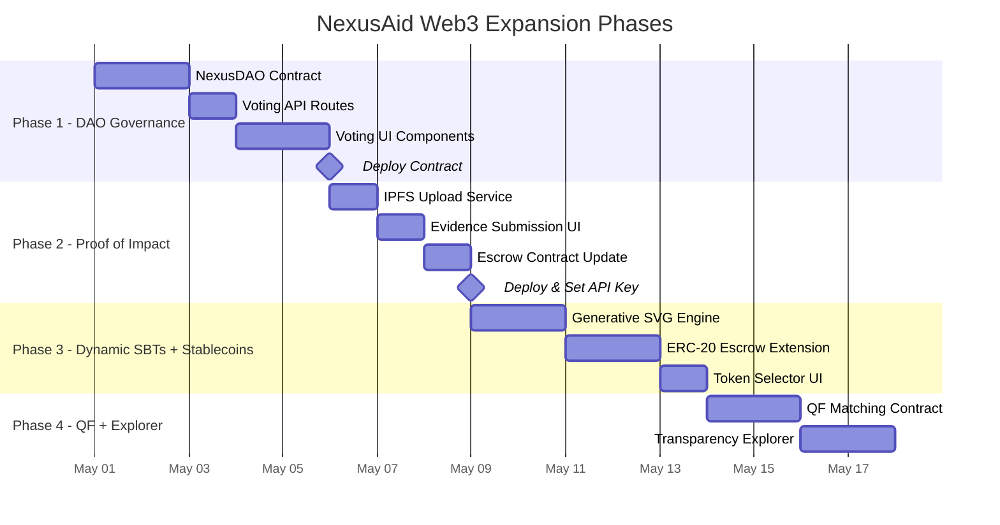

# 🏗️ NexusAid Web3 Feature Expansion — Implementation Plan

> **Scope:** 6 new Web3 features across 4 implementation phases.
> **Baseline:** Audited from the current codebase as of April 30, 2026.

---

## 📊 Current State Audit

### What's Already Built
| Feature | Contract | API Route | UI Component | Status |
|:---|:---|:---|:---|:---|
| Crypto Donations | `NexusEscrow.sol` | — | [DonateWithCrypto.tsx](file:///c:/Users/blazi/Downloads/NexusAid-Web3/src/components/web3/DonateWithCrypto.tsx) | ✅ Live |
| Milestone Escrow | `NexusEscrow.sol` | [/api/web3/milestones](file:///c:/Users/blazi/Downloads/NexusAid-Web3/src/app/api/web3/milestones/route.ts) | [MilestoneTracker.tsx](file:///c:/Users/blazi/Downloads/NexusAid-Web3/src/components/web3/MilestoneTracker.tsx) | ✅ Live |
| Soulbound Badges (SBTs) | `NexusReputation.sol` | [/api/web3/claim-badge](file:///c:/Users/blazi/Downloads/NexusAid-Web3/src/app/api/web3/claim-badge/route.ts) | [BadgeDisplay.tsx](file:///c:/Users/blazi/Downloads/NexusAid-Web3/src/components/web3/BadgeDisplay.tsx) | ✅ Live |
| Wallet Linking | — | [/api/web3/link-wallet](file:///c:/Users/blazi/Downloads/NexusAid-Web3/src/app/api/web3/link-wallet/) | [useWallet.ts](file:///c:/Users/blazi/Downloads/NexusAid-Web3/src/hooks/useWallet.ts) | ✅ Live |

### Key Conventions Identified
- **Server-side signing:** All on-chain writes use the `DEPLOYER_PRIVATE_KEY` via API routes (not client wallets)
- **ABI format:** Human-readable ABI strings in `src/lib/web3/*.ts`
- **Contract helpers:** Read-only fallback to `JsonRpcProvider(AMOY_RPC)`, write via `JsonRpcSigner`
- **Auth pattern:** Firebase ID token in `Authorization: Bearer` header → `adminAuth.verifyIdToken()`
- **Admin pattern:** `ADMIN_EMAILS` array imported from `eventService`
- **Styling:** Glassmorphism (`premium-glass`), custom CSS vars, Material Symbols icons
- **Notifications:** `sonner` toast system

---

## 🗺️ Implementation Roadmap



---

## Phase 1: NexusDAO — Community Governance Voting

> **Goal:** Replace the single-owner `approveMilestone()` flow with donor-weighted community voting.

### 1.1 Smart Contract: `NexusDAO.sol`

**New file:** `contracts/web3/NexusDAO.sol`

```solidity
// Core logic outline
contract NexusDAO {
    struct Proposal {
        uint256 campaignId;
        uint8   milestoneIndex;
        uint256 forVotes;
        uint256 againstVotes;
        uint256 deadline;       // block.timestamp + VOTING_PERIOD
        bool    executed;
        mapping(address => bool) hasVoted;
    }

    uint256 public constant VOTING_PERIOD = 3 days;
    uint256 public constant QUORUM_BPS = 3000; // 30% of donors must vote

    mapping(uint256 => Proposal) public proposals;

    function createProposal(uint256 campaignId, uint8 milestoneIndex) external;
    function vote(uint256 proposalId, bool support) external;
    function executeProposal(uint256 proposalId) external;
}
```

**Key design decisions:**
- Vote weight = `donorAmounts[campaignId][voter]` (read from NexusEscrow)
- SBT holders (Gold+) get a 1.5x multiplier via `NexusReputation.getBadgesByOwner()`
- Quorum: 30% of total raised must be represented in votes
- Voting window: 3 days after proposal creation

### 1.2 API Route: `/api/web3/governance`

**New file:** `src/app/api/web3/governance/route.ts`

| Action | Auth | Description |
|:---|:---|:---|
| `create-proposal` | Organizer | Submit a milestone for community vote |
| `vote` | Any donor (wallet linked) | Cast a weighted vote |
| `execute` | Anyone (after deadline) | Finalize and release funds if passed |
| `get-proposal` | Public | Read proposal status and vote counts |

### 1.3 UI Components

| File | Description |
|:---|:---|
| `src/components/web3/GovernancePanel.tsx` | Main voting card embedded in the event page |
| `src/components/web3/VoteProgressBar.tsx` | Visual For/Against bar with quorum indicator |
| `src/components/web3/ProposalHistory.tsx` | Timeline of past votes on a campaign |

**Integration point:** Replace the "Approve & Release" button in [MilestoneTracker.tsx](file:///c:/Users/blazi/Downloads/NexusAid-Web3/src/components/web3/MilestoneTracker.tsx#L253-L266) with a "Start Community Vote" flow.

### 1.4 Files Modified

| Existing File | Change |
|:---|:---|
| [MilestoneTracker.tsx](file:///c:/Users/blazi/Downloads/NexusAid-Web3/src/components/web3/MilestoneTracker.tsx) | Replace admin-only approve with governance vote trigger |
| [escrowContract.ts](file:///c:/Users/blazi/Downloads/NexusAid-Web3/src/lib/web3/escrowContract.ts) | Add DAO contract ABI + helper |
| [event/[id]/page.tsx](file:///c:/Users/blazi/Downloads/NexusAid-Web3/src/app/(app)/event/[id]/page.tsx) | Mount `<GovernancePanel>` below milestone tracker |
| `hardhat.config.js` | No changes needed |

### 1.5 Autonomy Assessment

| Step | Who | Notes |
|:---|:---|:---|
| Write `NexusDAO.sol` | 🟢 Me | |
| Write deploy script | 🟢 Me | `scripts/deploy/deploy-dao.js` |
| Write API route | 🟢 Me | |
| Write UI components | 🟢 Me | |
| Run `npx hardhat compile` | 🟢 Me | |
| Deploy to Amoy testnet | 🔴 **You** | Run: `npx hardhat run scripts/deploy/deploy-dao.js --network amoy` |
| Paste contract address | 🔴 **You** | Add `NEXT_PUBLIC_DAO_CONTRACT=0x...` to `.env.local` |

---

## Phase 2: IPFS Proof-of-Impact

> **Goal:** Require verifiable evidence (photos, reports) pinned to IPFS when proposing milestone completion.

### 2.1 Dependencies

```bash
npm install pinata-web3
```

### 2.2 IPFS Upload Service

**New file:** `src/lib/web3/ipfs.ts`

```typescript
// Wraps Pinata SDK for file + JSON uploads
export async function pinFileToIPFS(file: File): Promise<string>;      // returns CID
export async function pinJSONToIPFS(data: object): Promise<string>;    // returns CID
export function getIPFSGatewayUrl(cid: string): string;                // https://gateway.pinata.cloud/ipfs/{cid}
```

### 2.3 Contract Modification: `NexusEscrowV2.sol`

**New file:** `contracts/web3/NexusEscrowV2.sol` (extends current logic)

```diff
 struct Milestone {
     string  description;
     MilestoneStatus status;
     uint256 releasedAmount;
+    string  evidenceCID;     // IPFS CID of proof-of-impact
 }

 function proposeMilestoneComplete(
     uint256 _campaignId,
     uint8 _milestoneIndex,
+    string calldata _evidenceCID
 ) external;
```

### 2.4 API Route: `/api/web3/evidence`

**New file:** `src/app/api/web3/evidence/route.ts`

- `POST`: Upload file to Pinata → return CID
- Validates file type (image/pdf only), max 10MB
- Stores CID in Firestore alongside the milestone update

### 2.5 UI Components

| File | Description |
|:---|:---|
| `src/components/web3/EvidenceUploader.tsx` | Drag-drop uploader with preview, integrated into milestone propose flow |
| `src/components/web3/EvidenceViewer.tsx` | Displays IPFS-pinned images/PDFs in a lightbox on the event page |

### 2.6 Files Modified

| Existing File | Change |
|:---|:---|
| [MilestoneTracker.tsx](file:///c:/Users/blazi/Downloads/NexusAid-Web3/src/components/web3/MilestoneTracker.tsx) | Add evidence upload step before `handlePropose` |
| [milestones/route.ts](file:///c:/Users/blazi/Downloads/NexusAid-Web3/src/app/api/web3/milestones/route.ts) | Include `evidenceCID` in the propose transaction |
| [escrowContract.ts](file:///c:/Users/blazi/Downloads/NexusAid-Web3/src/lib/web3/escrowContract.ts) | Update ABI for new `proposeMilestoneComplete` signature |

### 2.7 Autonomy Assessment

| Step | Who | Notes |
|:---|:---|:---|
| Write all code (contract, API, UI) | 🟢 Me | |
| Install `pinata-web3` | 🟢 Me | |
| Create Pinata account | 🔴 **You** | [pinata.cloud](https://pinata.cloud) — free tier is fine |
| Add `PINATA_JWT` to `.env.local` | 🔴 **You** | Paste the JWT from Pinata dashboard |
| Deploy `NexusEscrowV2` | 🔴 **You** | Run deploy script, update `NEXT_PUBLIC_ESCROW_CONTRACT` |

---

## Phase 3: Dynamic SBTs + Stablecoin Support

### 3A: Generative Dynamic SVG Badges

> **Goal:** Badges visually "evolve" — the SVG art changes based on volunteer hours/tier.

### 3A.1 SVG Generator Engine

**New file:** `src/lib/web3/badgeSvgGenerator.ts`

Generates unique SVGs server-side with:
- **Tier-based color palettes** (Bronze = warm earth tones → Diamond = holographic gradients)
- **Animated elements** using SVG `<animate>` tags (pulse rings, particle effects)
- **Dynamic stats** embedded in the SVG (hours, donations, campaigns)
- **Unique geometric patterns** seeded from wallet address hash (like GitHub identicons)

### 3A.2 Files Modified

| Existing File | Change |
|:---|:---|
| [claim-badge/route.ts](file:///c:/Users/blazi/Downloads/NexusAid-Web3/src/app/api/web3/claim-badge/route.ts) | Replace the static emoji SVG (line 35) with the generative engine |
| [BadgeDisplay.tsx](file:///c:/Users/blazi/Downloads/NexusAid-Web3/src/components/web3/BadgeDisplay.tsx) | Render actual SVG from `tokenURI` metadata instead of emoji fallback |

### 3A.3 Autonomy: 🟢 100% Me — No intervention needed

---

### 3B: Stablecoin (USDC) Donations

> **Goal:** Allow donations in USDC to protect against MATIC volatility.

### 3B.1 Contract: `NexusEscrowV2.sol` extension

```diff
+ import "@openzeppelin/contracts/token/ERC20/IERC20.sol";

+ IERC20 public immutable usdc;

+ function donateUSDC(uint256 _campaignId, uint256 _amount) external {
+     usdc.transferFrom(msg.sender, address(this), _amount);
+     // ... track donation
+ }
```

Uses the Polygon Amoy USDC test token contract.

### 3B.2 UI Changes

| File | Change |
|:---|:---|
| [DonateWithCrypto.tsx](file:///c:/Users/blazi/Downloads/NexusAid-Web3/src/components/web3/DonateWithCrypto.tsx) | Add token selector toggle (MATIC / USDC) |
| New: `src/components/web3/TokenSelector.tsx` | Pill toggle component for selecting payment token |

### 3B.3 Autonomy Assessment

| Step | Who |
|:---|:---|
| Write ERC-20 escrow logic | 🟢 Me |
| Write token selector UI | 🟢 Me |
| Deploy updated contract | 🔴 **You** |
| Get testnet USDC (faucet) | 🟡 **You** (optional, for testing) |

---

## Phase 4: Quadratic Funding + Transparency Explorer

### 4A: Quadratic Funding Matching Pool

> **Goal:** A matching pool smart contract that distributes bonus funds to campaigns based on the *number of unique donors*, not total amount.

### 4A.1 Contract: `NexusQF.sol`

**New file:** `contracts/web3/NexusQF.sol`

```solidity
contract NexusQF {
    struct Round {
        uint256 matchingPool;
        uint256 startTime;
        uint256 endTime;
        uint256[] campaignIds;
    }

    // QF formula: match_i = matchingPool * (sqrt(sum_of_individual_donations_i))^2 / sum_of_all_sqrt_sums
    function calculateMatching(uint256 roundId) public view returns (uint256[] memory);
    function distributeMatching(uint256 roundId) external onlyOwner;
}
```

### 4A.2 New Files

| File | Description |
|:---|:---|
| `contracts/web3/NexusQF.sol` | QF matching pool contract |
| `scripts/deploy/deploy-qf.js` | Deployment script |
| `src/lib/web3/qfContract.ts` | ABI + helpers |
| `src/app/api/web3/qf/route.ts` | API for round management |
| `src/components/web3/QFRoundCard.tsx` | Shows active QF round with matching multipliers |
| `src/app/(app)/funding/page.tsx` | Dedicated QF rounds page |

### 4A.3 Autonomy Assessment

| Step | Who |
|:---|:---|
| Write all code | 🟢 Me |
| Deploy contract | 🔴 **You** |
| Seed matching pool with testnet MATIC | 🔴 **You** |

---

### 4B: On-Chain Transparency Explorer

> **Goal:** A dedicated page showing every on-chain transaction in real-time — donations, milestone approvals, badge mints — providing full audit trail.

### 4B.1 New Files

| File | Description |
|:---|:---|
| `src/app/(app)/transparency/page.tsx` | Full-page explorer with live event feed |
| `src/components/web3/TransactionFeed.tsx` | Real-time feed of on-chain events using `ethers.js` event listeners |
| `src/components/web3/CampaignAuditTrail.tsx` | Per-campaign timeline: created → donations → milestones → funds released |
| `src/components/web3/OnChainStats.tsx` | Aggregate stats (total locked, total released, total badges, total donors) |

### 4B.2 Data Source

Reads directly from the blockchain using `contract.queryFilter()` — no new API routes needed. All data is derived from existing contract events:
- `DonationReceived`, `MilestoneApproved`, `FundsReleased` from NexusEscrow
- `BadgeMinted` from NexusReputation

### 4B.3 Autonomy: 🟢 100% Me — Pure frontend, reads from existing deployed contracts

---

## 📦 Dependency Summary

```bash
# New packages required
npm install pinata-web3    # Phase 2 only
```

> [!NOTE]
> All other features use the existing `ethers@6`, `@openzeppelin/contracts@4.9.6`, and Hardhat toolchain already in your [package.json](file:///c:/Users/blazi/Downloads/NexusAid-Web3/package.json).

---

## 📁 Complete File Map

### New Files (I Create)

```
contracts/web3/
├── NexusDAO.sol              # Phase 1
├── NexusEscrowV2.sol         # Phase 2 + 3B
└── NexusQF.sol               # Phase 4A

scripts/deploy/
├── deploy-dao.js             # Phase 1
├── deploy-escrow-v2.js       # Phase 2
└── deploy-qf.js              # Phase 4A

src/lib/web3/
├── daoContract.ts            # Phase 1
├── ipfs.ts                   # Phase 2
├── qfContract.ts             # Phase 4A
└── badgeSvgGenerator.ts      # Phase 3A

src/app/api/web3/
├── governance/route.ts       # Phase 1
├── evidence/route.ts         # Phase 2
└── qf/route.ts               # Phase 4A

src/components/web3/
├── GovernancePanel.tsx        # Phase 1
├── VoteProgressBar.tsx        # Phase 1
├── ProposalHistory.tsx        # Phase 1
├── EvidenceUploader.tsx       # Phase 2
├── EvidenceViewer.tsx         # Phase 2
├── TokenSelector.tsx          # Phase 3B
├── QFRoundCard.tsx            # Phase 4A
├── TransactionFeed.tsx        # Phase 4B
├── CampaignAuditTrail.tsx     # Phase 4B
└── OnChainStats.tsx           # Phase 4B

src/app/(app)/
├── funding/page.tsx           # Phase 4A
└── transparency/page.tsx      # Phase 4B
```

### Existing Files Modified

| File | Phases |
|:---|:---|
| [MilestoneTracker.tsx](file:///c:/Users/blazi/Downloads/NexusAid-Web3/src/components/web3/MilestoneTracker.tsx) | 1, 2 |
| [DonateWithCrypto.tsx](file:///c:/Users/blazi/Downloads/NexusAid-Web3/src/components/web3/DonateWithCrypto.tsx) | 3B |
| [BadgeDisplay.tsx](file:///c:/Users/blazi/Downloads/NexusAid-Web3/src/components/web3/BadgeDisplay.tsx) | 3A |
| [escrowContract.ts](file:///c:/Users/blazi/Downloads/NexusAid-Web3/src/lib/web3/escrowContract.ts) | 1, 2 |
| [milestones/route.ts](file:///c:/Users/blazi/Downloads/NexusAid-Web3/src/app/api/web3/milestones/route.ts) | 2 |
| [claim-badge/route.ts](file:///c:/Users/blazi/Downloads/NexusAid-Web3/src/app/api/web3/claim-badge/route.ts) | 3A |
| [event/[id]/page.tsx](file:///c:/Users/blazi/Downloads/NexusAid-Web3/src/app/(app)/event/[id]/page.tsx) | 1, 2 |
| [leaderboard/page.tsx](file:///c:/Users/blazi/Downloads/NexusAid-Web3/src/app/(app)/leaderboard/page.tsx) | 4B |
| `README.md` | All |

---

## 🚦 Intervention Summary

| Action Required From You | Phase | One-Time? |
|:---|:---|:---|
| Run contract deploy scripts (3 contracts) | 1, 2, 4A | ✅ Yes |
| Paste new contract addresses into `.env.local` | 1, 2, 4A | ✅ Yes |
| Create Pinata account + paste JWT | 2 | ✅ Yes |
| Seed QF matching pool with testnet MATIC | 4A | ✅ Yes |

> [!TIP]
> **Total user intervention: ~15 minutes across all 4 phases.** Everything else — Solidity, TypeScript, React, API routes, styling — I handle completely.

---

## 🎯 Recommended Execution Order

1. **Phase 3A** (Dynamic SBTs) — Zero intervention, immediate visual impact
2. **Phase 4B** (Transparency Explorer) — Zero intervention, adds a major new page
3. **Phase 1** (DAO Governance) — One deploy step from you, highest Web3 value
4. **Phase 2** (IPFS Evidence) — One API key + one deploy, strongest trust signal
5. **Phase 3B** (Stablecoins) — One deploy, practical utility
6. **Phase 4A** (Quadratic Funding) — One deploy + seed funds, most advanced

> [!IMPORTANT]
> **Which phase(s) should I start building?** I recommend starting with **Phase 3A + 4B** simultaneously since they require zero intervention and deliver the most visible results immediately.

---

## ✅ Progress Update: Event Indexing & IPFS (Completed)

We have successfully completed the core Web3 infrastructure setup, which bridges the gap between your smart contracts, your backend server, and your frontend dashboard.

**What We Just Finished:**
1. **IPFS Metadata Integration:** 
   - Smart contracts (`NexusDonate`, `NexusEscrow`) were upgraded to accept IPFS CIDs for campaign metadata and milestone evidence.
   - The backend listeners were updated to capture and index these new fields in Firestore.
2. **Robust Deployment System:** 
   - Created a master deployment script (`deploy-all.js`) that deploys all contracts, seeds demo data, and automatically generates a copy-pasteable `.env` block.
3. **Backend Indexer Connected:** 
   - The backend now successfully connects to your local Hardhat node and your Firebase database (using the frontend's `serviceAccountKey.json`), meaning it actively listens to smart contract events.
4. **Frontend Resilience:** 
   - Added a fallback state to the Blockchain Dashboard so the page doesn't crash when the local node is offline.

---

## 🚀 Immediate Next Steps

Here is exactly what needs to be done next:

### 🔴 From Your Side (The User)
1. **Get Pinata API Keys:**
   - Go to [pinata.cloud](https://pinata.cloud), create a free account, and generate API keys.
   - Add `PINATA_API_KEY`, `PINATA_SECRET_KEY`, and `NEXT_PUBLIC_PINATA_GATEWAY_URL` to your `frontend/.env.local`.
   *(Note: The codebase is already prepared to use these via `src/lib/ipfs/pinata.ts`)*
2. **Review the UI:**
   - Go to your local Blockchain Dashboard (`http://localhost:3000/dashboard/blockchain`).
   - Confirm that the stats are loading correctly and it shows connected to your local Hardhat node.
3. **Decide the Next Feature:**
   - Review the roadmap above. Do you want to move into **Gasless Transactions (Biconomy)** next to make the platform frictionless, or proceed with **Dynamic SVG Badges (Phase 3A)** as recommended?

### 🟢 From My Side (The Agent)
1. **Frontend Integration of IPFS Hooks:**
   - Once your Pinata keys are set, I need to wire up the `useIPFSUpload` hook into the "Create Campaign" and "Propose Milestone" UI forms so users can actually upload images/documents to IPFS.
2. **Gasless Meta-Transactions:**
   - If you choose Biconomy, I will write the `NexusForwarder.sol` contract and implement the EIP-712 signing logic in the frontend to sponsor gas fees for your users.
3. **Proceed with the Roadmap:**
   - I am ready to implement any phase from the roadmap above as soon as you give the green light.
